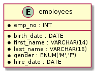
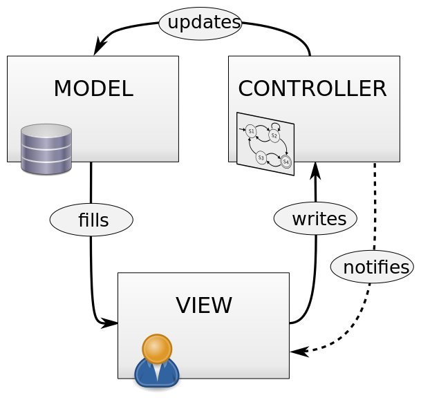

= Human Resources Management System
Ansgar Nell <ansgar.nell@(Google's email).com>
1.0, March 30, 2020, Asciidoctor 1.5 article template
:toc:
:icons: font

This document describes the Human Resources (HR) Management System developed based on the
https://dev.mysql.com/doc/employee/en/[Employees Sample Database] provided by https://www.mysql.com/[MySQL].
footnote:[The development of the project is explained in the Medium Article (will be linked when finished)]

== Introduction

The HR Management System development has been done as a request received by the Imaginary Company, which wants to
update their current MS-DOS based solution to a Web environment.

== Existing Database

The solution must be done taken into account that the database already exists. The company wishes to continue
working with it without doing a migration or losing any data, but it is possible to add new tables and information.
The schema can be seen in the next image:

[#database-schema]
.Database Schema

== Existing MS-DOS System

Our client currently works with a MS-DOS based system. This program will be used as an orientation for the new
project, having as the main goal to replicate the existing navigation options and operations.

== Requirements

=== Functional Requirements

Based on the specifications received from the client, we have the following functional requirements:

[#web-based-solution]
=== Web Based Solution

The application must be accessed using a web browser.

[#privilege-levels]
=== Privilege Levels

The employees who have access to the database must belong to only and exclusively one of the following levels:

[#privilege-levels-levels]
.Privilege levels (in descending order)
. HR Manager (Manager)
. HR Senior Staff (Senior Staff)
. HR Staff (Staff)

Every level must have all the permissions from the lower levels.

[#view-information]
=== View Information

All the information stored in the database is accessible, except for the next restrictions:

* Managers' salaries: only allowed to Senior Staff or higher.

As detailed in the indications about the navigation, the system sitemap must follow the next diagram:

ifdef::env-github[image::/images/sitemap.png[Diagram classes]]
ifndef::env-github[]
[plantuml,images/sitemap,png]
....
artifact departments
artifact employees
artifact employee as "employee information"
departments <-right-> employees
employees <-right-> employee
departments <-right-> employee : manager information
....

[#change-information]
=== Change information

The only information that can be changed in the database are the salaries, and only Senior Staff
or higher levels are allowed to do it. Following restrictions apply:

* Managers' salaries: only the Manager level must be able to change this information.

=== Non-functional Requirements

== Used Technologies

.Used Technologies
|===
| Name | Version | Use

|https://spring.io/projects/spring-boot[Spring Boot]
|2.2.6.RELEASE
|Backend Implementation

|https://www.jetbrains.com/idea/[IntelliJ]
|2019.3.4 (Community Edition)
|Java IDE

|https://www.docker.com/[Docker]
|19.03.8
|Containerization

|https://asciidoctor.org/[Asciidoctor]
|2.0.10
|Documentation

|https://www.mysql.com/[MySQL]
|8.0.19
|Database
|===

== System Architecture

The system will be developed using the Model-View-Controller (MVC) software design pattern.

.MVC pattern
.(taken from https://commons.wikimedia.org/wiki/File:MVC_Diagram_(Model-View-Controller).svg[Wikimedia Commons])

=== Model

The original database schema can be seen in <<#database-schema>>. Let's analyze each of the tables and it contents.

==== Departments

The departments entity diagram looks as follows:

ifdef::env-github[image::/images/departments-schema.png[Diagram classes]]
ifndef::env-github[]
[plantuml,images/departments-schema,png]
....

entity Department {
    * dept_no : CHAR(4)
    --
    * dept_name : VARCHAR(40)     .
}
....

