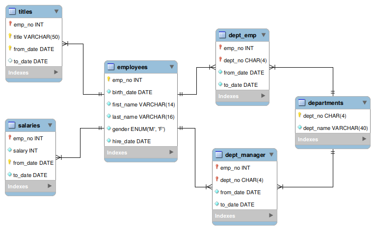

= Human Resources Management System
Ansgar Nell <ansgar.nell@(Google's email).com>
1.0, March 30, 2020
:toc:
:icons: font

This document describes the Human Resources (HR) Management System developed based on the
https://dev.mysql.com/doc/employee/en/[Employees Sample Database] provided by https://www.mysql.com/[MySQL].
footnote:[The development of the project is explained in the Medium Article (will be linked when finished)]

== Introduction

The HR Management System development has been done as a request received by the Imaginary Company, which wants to
update their current MS-DOS based solution to a Web environment.

== Existing Database

The solution must be done taken into account that the database already exists. The company wishes to continue
working with it without doing a migration or losing any data, but it is possible to add new tables and information.
The schema can be seen in the next image:

[#database-schema]
.Database Schema

== Existing MS-DOS System

Our client currently works with a MS-DOS based system. This program will be used as an orientation for the new
project, having as the main goal to replicate the existing navigation options and operations.

== Requirements

=== Functional Requirements

Based on the specifications received from the client, we have the following functional requirements:

[#web-based-solution]
==== Web Based Solution

The application must be accessed using a web browser.

[#privilege-levels]
==== Privilege Levels

The employees who have access to the database must belong to only and exclusively one of the following levels:

[#privilege-levels-levels]
.Privilege levels (in descending order)
. HR Manager (Manager)
. HR Senior Staff (Senior Staff)
. HR Staff (Staff)

Every level must have all the permissions from the lower levels.

[#view-information]
==== View Information

All the information stored in the database is accessible, except for the next restrictions:

* Managers' salaries: only allowed to Senior Staff or higher.

As detailed in the indications about the navigation, the system sitemap must follow the next diagram:

ifdef::env-github[]
.Sitemap
image::/images/sitemap.png[Sitemap]
endif::env-github[]
ifndef::env-github[]
[plantuml,images/sitemap,png]
....
skinparam defaultTextAlignment center
artifact "**Main page**\nDepartments List" as departments
artifact "Department Information" as department
artifact "Employee Information" as employee
departments <-right-> department
department <-right-> employee
departments <-right-> employee : manager information
....
endif::env-github[]

The information that each view must provide is described in the next sections.

* Departments List: This is the main entry point to the application. It must show a complete list of all departments
containing for each the following information:
** Department number
** Department name

* Department Information: This view must contain three different sections with different information.
** Information about the department itself:
*** Department number
*** Department name
** Information about the current and past managers, containing each:
*** First name
*** Last name
** A list of all its employees, with the following fields for each of them:
*** Employee number
*** First name
*** Last name
*** Title

* Employee Information: This view must contain information about the selected employee:
** Employee number
** First name
** Last name
** Birth date
** Gender
** Hire date
** A list of titles with:
*** Title
*** From date
*** To date

[IMPORTANT]
====
This part must be shown **ONLY** if:

* The employee **IS NOT** or **HAS NEVER** been a manager
* The **CURRENT USER** belongs to the _Senior Staff_ **OR HIGHER** level

If one or both of the points described apply, then show a list of salaries with the following fields:

* Salary
* From date
* To date
====

* In case it is or has been a manager, the view must also show a list with the following fields for each entry:
** Department number
** Department name
** From date
** To date

[#change-information]
==== Change information

The only information that can be changed in the database are the salaries, and only Senior Staff
or higher levels are allowed to do it. Following restrictions apply:

* Managers' salaries: only the Manager level must be able to change this information.

=== Non-functional Requirements

== Used Technologies

.Used Technologies
|===
| Name | Version | Use

|https://spring.io/projects/spring-boot[Spring Boot]
|2.2.6.RELEASE
|Backend Implementation

|https://www.jetbrains.com/idea/[IntelliJ]
|2019.3.4 (Community Edition)
|Java IDE

|https://www.docker.com/[Docker]
|19.03.8
|Containerization

|https://asciidoctor.org/[Asciidoctor]
|2.0.10
|Documentation

|https://www.mysql.com/[MySQL]
|8.0.19
|Database

|https://angular.io/[Angular]
|9.1.0
|Frontend Implementation

|https://www.jetbrains.com/webstorm/[WebStorm]
|2019.3.4
|Angular IDE

|https://semantic-ui.com/[Semantic UI]
|2.2.13
|CSS Styling
|===

== System Design

The system will be developed using the Model-View-Controller (MVC) software design pattern.

.MVC pattern
.(taken from https://commons.wikimedia.org/wiki/File:MVC_Diagram_(Model-View-Controller).svg[Wikimedia Commons])
image::images/mvc-diagram.jpg[MVC Software Design Pattern]

=== Model

Refer to the link:Model.adoc[Model Documentation] for more information.

=== Controller

Refer to the link:Controller.adoc[Controller Documentation] for more information.

=== View

The View part of the application is implemented using the Angular framework. The documentation can be consulted
https://github.com/AnsgarNell/HRToolFrontend[here].